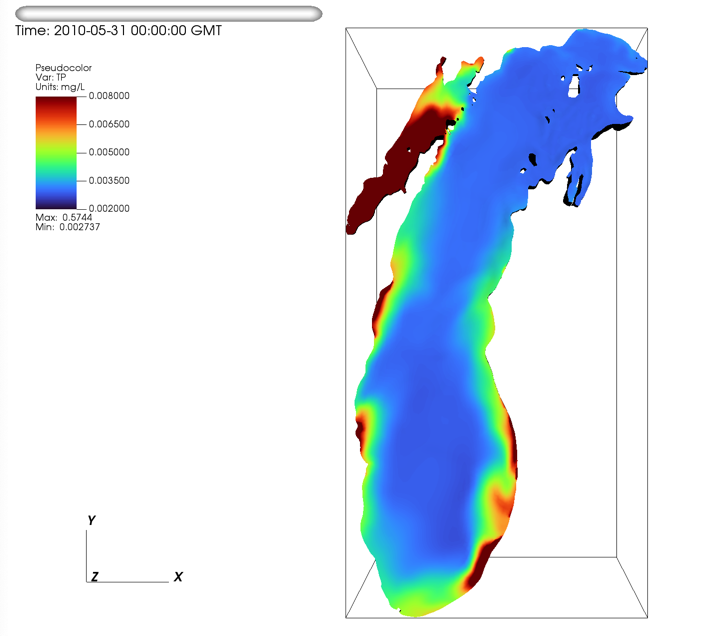
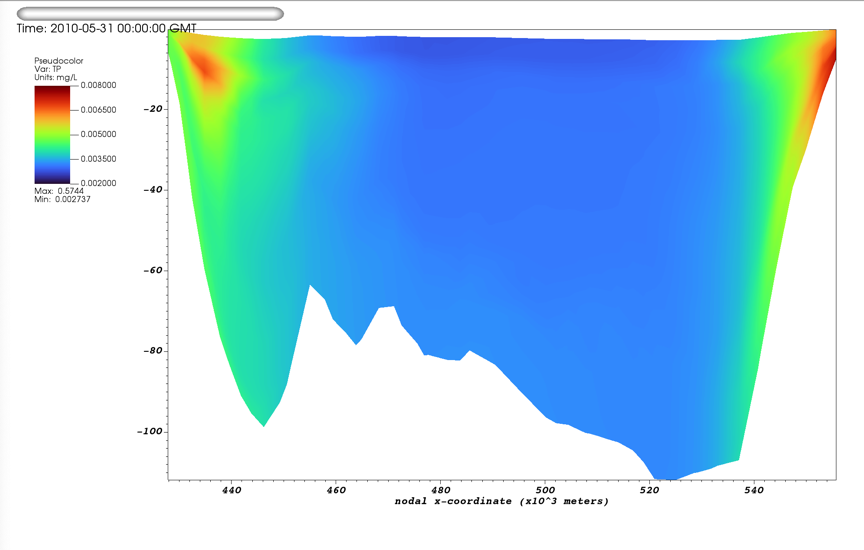
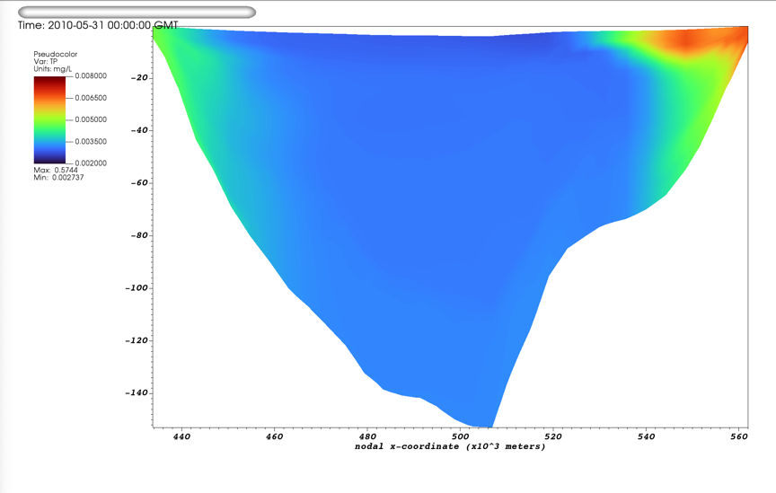
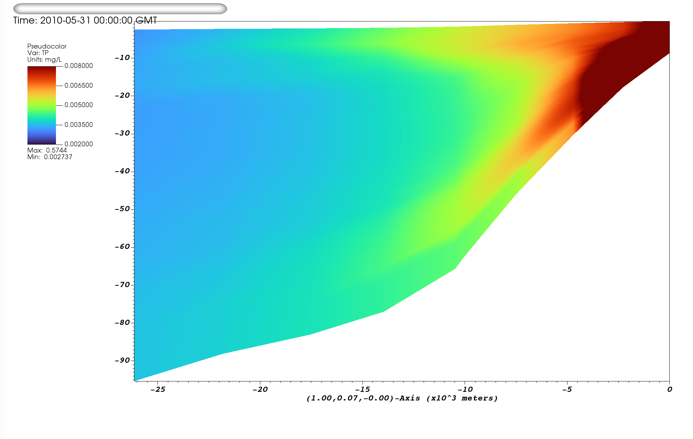
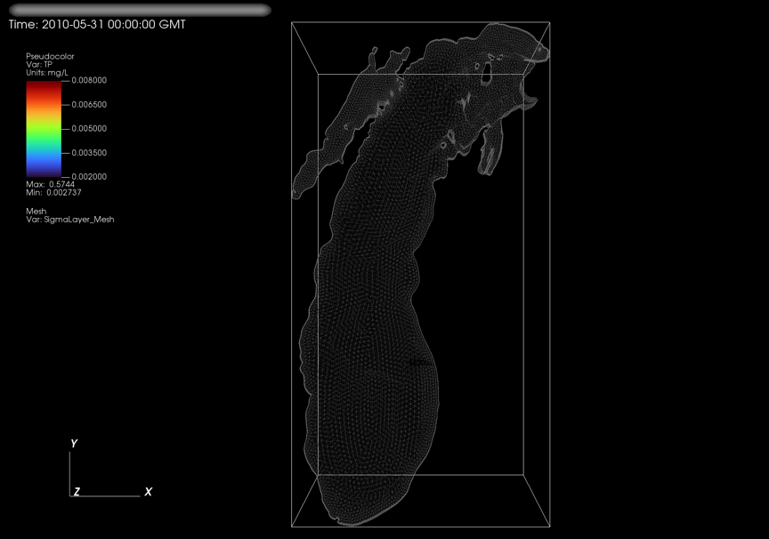
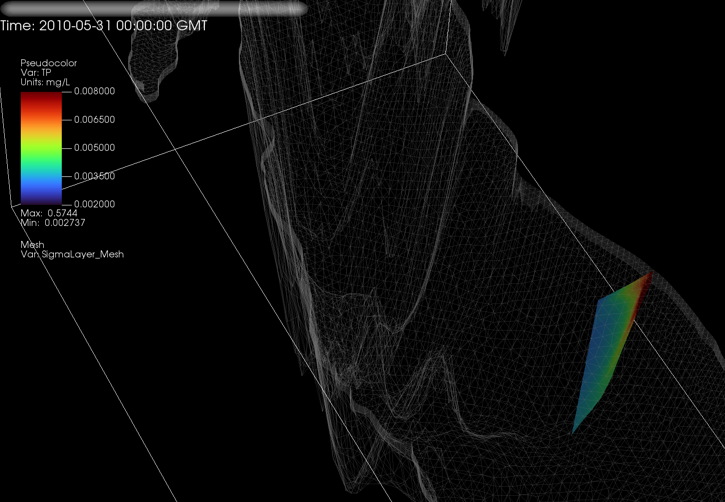

# Images from FVCOM Lake Michigan

## create_pseudocolor_3Dplot(setvars)
Creates a 3D plot



## create_pseudocolor_2Dslice(setvars) 
2D at constant Y (choose Y as percent of spatial extent)


To use a different percent, just change "percent" 
```
setvars["percent"]= 20
```


## create_pseudocolor_2Dtransect(setvars)
2D transect between two chosen points


## transect_against_3D(setvars)
2D transect shown within the 3D grid


After Rotating:



