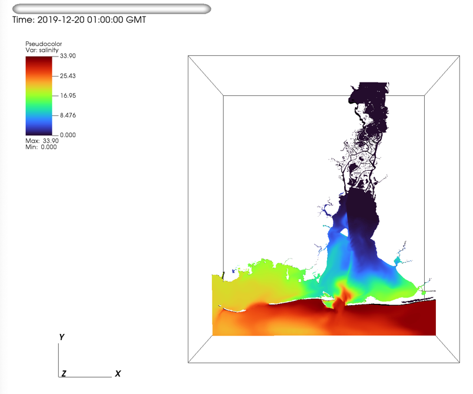
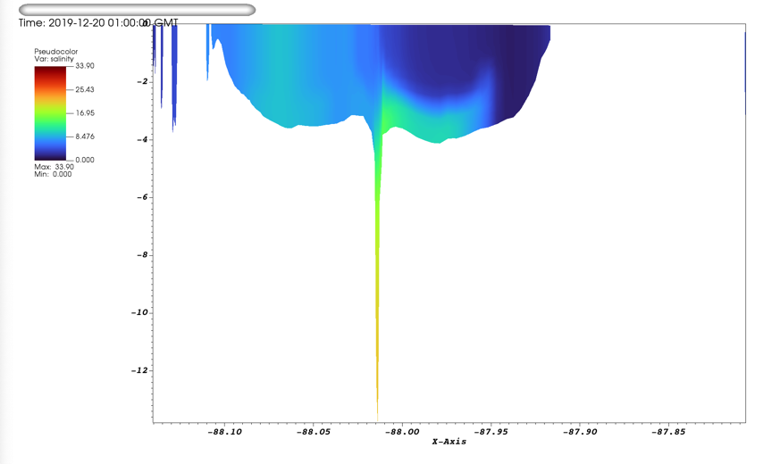
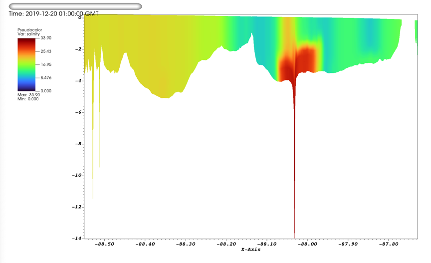
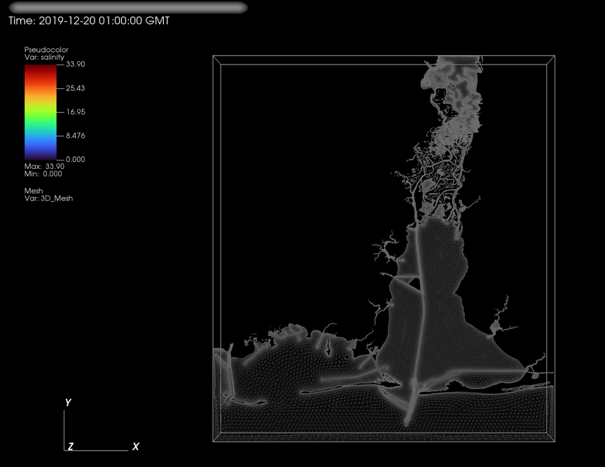
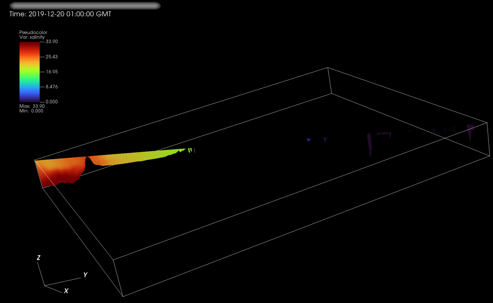
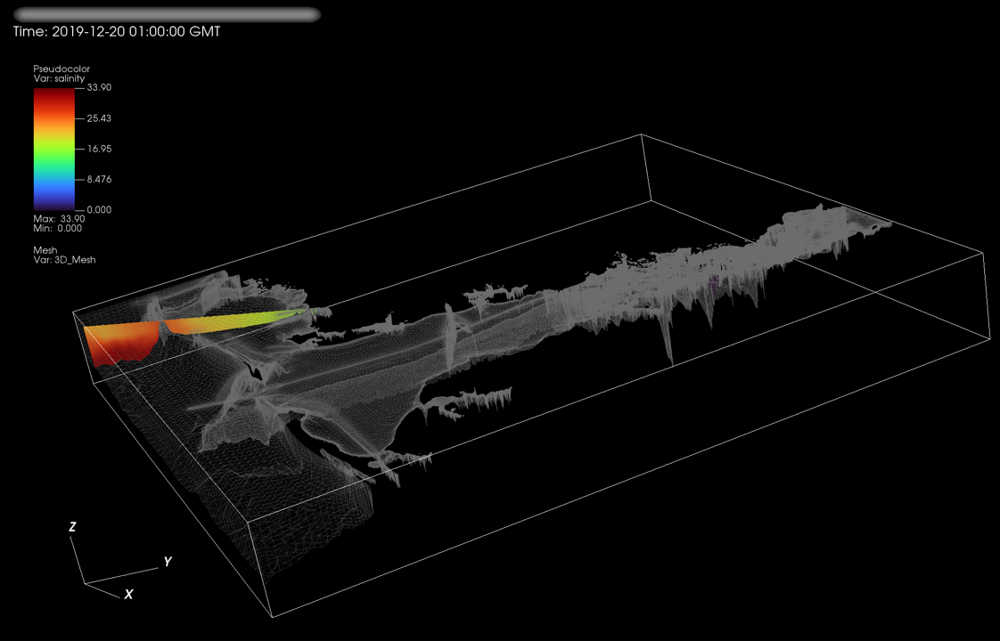

# Images from SCHISM Mobile Bay

## create_pseudocolor_3Dplot(setvars)
Creates a 3D plot




## create_pseudocolor_2Dslice(setvars) 
2D at constant Y (choose Y as percent of spatial extent)



To use a different percent, just change "percent" 
```
setvars["percent"]= 20
create_pseudocolor_2Dslice(setvars) 
```



## transect_against_3D(setvars)
2D transect shown within the 3D grid



For large grids, it takes forever to rotate when opacity is on. First, "Hide" the Mesh variable. Rotate it until you find a good angle for the transect, then "Show".

After Rotating and Hiding:



Then Show:


