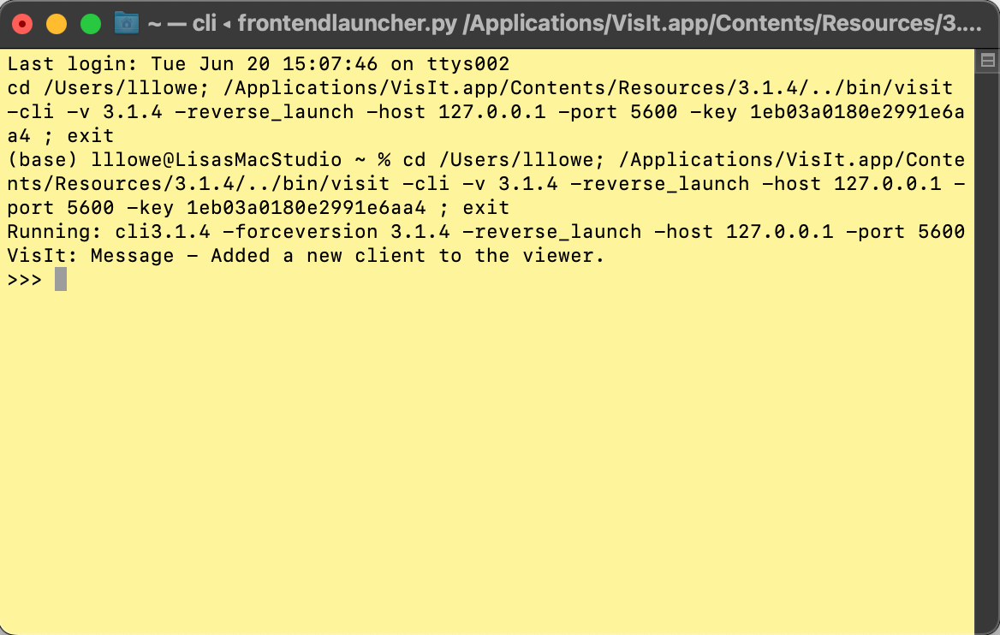

# visit-scripts
This repo is for sharing and version control of VisIt scripts, most of which were originally developed for FVCOM and SCHISM.

## Use the GUI first
See the [VisIt Tutorial Playlist](https://youtube.com/playlist?list=PLzDPdMiOzO52Mxk1xKWVKBXe2m9mwojSE) for demos on using VisIt interactively (GUI).  Despite the names, the steps in the videos work for many datasets, not just FVCOM or SCHISM.  

VisIt can usually generate a nice pseduocolor plot with just about any dataset.  If you open the dataset and see a bunch of weird and crazy garbage, check the [VisIt for SCHISM](https://youtu.be/mvCu8vCbTLs) video, which uses a threshold operator to remove garbage.  (Usually, the 'garbage' is not really garbage, just missing or NAN cells due to land masks or wetting and drying.)

The main purpose of VisIt scripts is to make thousands of images from large quantities of data residing on HPC systems.  If you aren't doing that, and these scripts don't work for you, how about just using the GUI?  :-)

## Version Warning

**Use VisIt 3.1.4**

Currently, we are running on Expanse, at SDSC, and they are using VisIt 3.1.4.  To use client-server mode, *my* VisIt has to match *their* VisIt.  If you find lines that don't work for newer versions of VisIt, please let me know and I can do an update, BUT...if a modification for a newer version breaks 3.1.4, I will not update it at this time.  Please fork this repo and make all the changes you want!  We'll see you later, especially when they install a new VisIt on Expanse.

## Contents

There are three main types of scripts in the repo
- start scripts
- batch scripts
- movie (ffmpeg) scripts


## Start scripts

The main purpose of a start script is to set up the environment so you can launch your favorite plot without having to click a bunch of stuff in the GUI.  See a [3D mesh with transect](imgs/rotateLM.png) for an example of something you'd rather not do in the GUI twice.

A start script
- adds the path (SCRIPT_PATH) of setup_visit.py, the script equivalent of setting a PYTHONPATH environment
- adds the path to the netCDF dataset (FILE_NAME)
- imports visit, a Python library for VisIt commands
- imports setup_visit, my Python library defining functions and macros for creating plots based on a Python dictionary setvars, which defines the most often changed parameters, e.g., file, variable, colormap, scale, etc.
- defines default values for setvars.  These default parameters should get you a decent plot for the intended dataset.
- lists the available plot commands with an example of changing a single parameter in setvars

Try *start_fvcom_lm.py* using instructions for [Windows](Win10.md) or [Mac](MacStartup.md).  While going through the steps, to clarify where to copy, paste, and click, see the video [VisIt Start Scripts](https://m.youtube.com/watch?v=b68PV_xDbxI).

Start scripts with good default parameters are available for the following:
- start_fvcom_lm.py: FVCOM Lake Michigan **TP model** data. Expected outputs are shown in [LM](LM.md). 
- start_fvcom_le.py: FVCOM Lake Erie **TP model** data
- start_schism_mb.py: SCHISM Mobile Bay data. Expected outputs are shown in [MB](MB.md). 
- start_schism_toy.py: SCHISM toy grid (from ECO-TOY)
- start_efdc_slre.py: EFDC-CGEM for St. Louis River Estuary

After understanding what setvars does, copy a start script to a different file and modify for your dataset.

For reference, see [VisIt's Python Scripting tutorial](https://visit-sphinx-github-user-manual.readthedocs.io/en/develop/python_scripting/index.html).

*Have a different dataset?  Scroll to the bottom for a Note.*

## Batch scripts

Batch scripts basically call the plot functions several times over a loop that redefines individual setvars items.  (Before trying the batch scripts, do the above start script demo to understand the use of setvars.)  There are different Python libraries that set the environments; setup_visit is mainly used for interactive start scripts while l3 and l3v are used for batch.  The timeslider in setup_visit has unintended consequences if used in batch mode.  These libraries are continuously evolving.

Batch scripts can get very specific to the use case, and this github mostly holds 'my' stuff, usually in-progress and again, continuously evolving.  The only thing tested and documented for use *by others* is [Instructions for running VisIt in batch mode to create images and movies for LEEM](sample-movie-scripts/README_LE.MD).  If you are on one of my projects, you are welcome to request a modified, frozen, and documented batch script for a specific purpose.


## Movie scripts (ffmpeg)

There are scripts for using ffmpeg after creating a set of images in batch.  A script loops over batch script parameters to define frame numbers and file paths, creates a string that is an ffmpeg command, then does a system call with that command string.  The scripts work on Hazel at NCSU without modification where ffmpeg is installed via a conda environment.  To run them in different environments, you may need to remove some of the arguments.  You can remove almost all of the optional arguments and still get a movie.  

You don't need to run a script to make a movie.  For example, if you have a directory ~/images filled with images with naming convention movieXXXX.png, with XXXX in logical numerical order, to make an mp4 movie named movie.mp4, you can do
```
cd ~/images
ffmpeg -framerate 15 -i movie%04d.png movie.mp4
```

See [Winffmpeg](Winffmpeg.md) for advice on installing ffmpeg on Windows.


## Instructions for running a start script

### Get the scripts
From the terminal (macOS or Linux) or MobaXterm (Windows), do
```
git clone https://github.com/l3-hpc/visit-scripts.git
cd visit-scripts
```

Here are more detailed instuctions for running on [Windows](Win10.md) or [Mac](MacStartup.md).

### Modify the paths
Before beginning, modify the start_XXX.py file for the location of these scripts and the data file.

For example, on Linux or Mac
```
##-- MODIFY -------------------
##--Set path to scripts----
SCRIPT_PATH = "/Users/yourusername/visit-scripts"
#Put the full path to the file
FILE_NAME = "/Users/yourusername/path-to-output-files/salinity_50.nc"
##-- END MODIFY ---------------
``` 

On Windows, it will look more like this:
```
##-- MODIFY -------------------
##--Set path to scripts----
SCRIPT_PATH = "C:\\Users\\yourusername\\visit-scripts\\"
#Put the full path to the file
FILE_NAME = "C:\\Users\\yourusername\\path-to-output-files\\salinity_50.nc"
##-- END MODIFY ---------------
``` 

Keep the script open, as you will cut and paste from it.

### Using VisIt
Open VisIt.

Launch the command line interface.  In the top VisIt nav bar:
- Controls:Launch CLI

A terminal (CLI command line) will pop up, looking something like (yours will probably be black):


From the start_ file, copy everything from `##----After modifying paths, BEGIN COPY---------------------` to `##---END COPY----------------##`.  Paste it into the terminal at the prompt `>>>`.

Choose one of the plots.  Start with
```
create_pseudocolor_3Dplot(setvars)
```

Note: copy/paste to VisIt CLI doesn't work when using a VM.  Maybe you can fix the settings to make it work.  (If you do, let me know how.). Otherwise, you'll have to type.  It is not actually that much to type, if you ignore the comments.  See [Windows Instructions](Win10.md), **Run example script for LM**, to see the commands without comment lines and extra whitespace.

## Notes and troubleshooting
- On my Mac, I need to open VisIt from the command line, i.e., type `visit &` in the terminal, or it won't open the CLI from VisIt.  I suspect Xcode is the culprit, but I'm not sure.
- For SCHISM, the plugin needs to be installed.  For Windows, [download them from the VIMS website](http://ccrm.vims.edu/w/index.php/Visualization_with_VisIT). For Linux or Mac, follow the instructions on the [schism_visit_plugin](https://github.com/schism-dev/schism_visit_plugin) page.
- For SCHISM, the starting date is hard coded to November 11, 2019.  I'll change it when I figure out how to pull that metadata from VisIt.  If you want to change it, it is in setup_visit.py.
- This is a work in progress, and there is little to no error checking so far. Open a GitHub Issue if you have questions, comments, concerns.  So far, my most common error is forgetting to put a comma after the variable in setvars when I change something.  Using wrong types (adding decimal to integer or mixing strings/bools/numbers) will also cause problems.

## Different dataset?

First: **The data must be a 3D netCDF file that either uses standard conventions(CF) or has a custom VisIt reader plugin.**  

For SCHISM and FVCOM:
- Start by making a copy of a start_fvcom or start_schism file, rename it.
- You'll want to change the default parameters.  
-   Start by making a copy of a start_fvcom or start_schism file, rename it. 
-   It is mandatory that you set `var` to data that is actually in your dataset.  
-   Then, as a starting point, I recommend setting `clim` = 0, and `scale` = 1.

For **not** SCHISM or FVCOM
- create_pseudocolor_3Dplot will probably work, and probably create_psudocolor_2Dslice.
- Transects use the 3D mesh coordinate, the name of your mesh will be different. That would need to be modified in setup_visit.py.  Or comment out the mesh parts.  (In that case, let me know, so I can improve that script.  Ideally that script would be universal for common 3D data.)


**These instructions have only been tested on my Mac Studio with M1 chip for the 'start_' files provided.**

## About VisIT
VisIt is an Open Source, interactive, scalable, visualization, animation and analysis tool.  See https://visit-dav.github.io/visit-website/index.html

# Thank you!
This work is funded by the National Oceanic and Atmospheric Administration's RESTORE Science Program under award NA19NOS4510194 and by contract to NCSU from EPA at ORD: Center for Computational Toxicology & Exposure (CCTE), Great Lakes Toxicology & Ecology Division. (Note: Contributed content is not reviewed or officially endorsed by either NOAA or EPA.)

