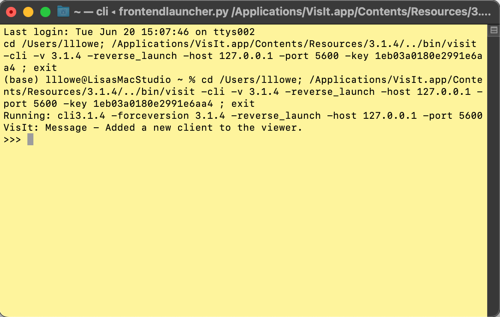

# Test start_ scripts on AWS Windows VM

## Install MobaXterm

Install MobaXterm: see these text instructions which include a link to a video tutorial. [Install MobaXterm](https://hpc.ncsu.edu/Documents/mobaxterm.php?ref=login)

Follow the instructions or video to change the MobaXterm perisistent home directory to `C:\Users\yourusername` (change yourusername to your actual username).

After opening MobaXterm for the first time, install nano:
```
apt install nano -y
```

## Install VisIt

These scripts were tested with VisIt 3.1.4.  Download [VisIt 3.1.4 for Windows](https://github.com/visit-dav/visit/releases/download/v3.1.4/visit3.1.4_x64.exe) and install.

## Clone this repo

From MobaXterm, do:
```
cd
git clone https://github.com/l3-hpc/visit-scripts.git
```

Change to the visit-scripts directory and check the contents
```
cd visit-scripts
ls
```

## Get sample Lake Michigan data

From MobaXterm, do:
```
wget https://renc.osn.xsede.org/ees210015-bucket01/testvisit/mi_0013.nc
```

Check size, it should be 383.4M
```
ls -lh mi_0013.nc
```

## Run example script for LM

For full instructions on using the 'start' scripts, see the [README](README.md), but to test, use the commands below.  The following commands are meant to be pasted in the VisIt CLI.  To open the VisIt CLI, open VisIt and launch the command line interface by doing the following:
- In the top VisIt nav bar, click Controls:Launch CLI 

A terminal (CLI command line) will pop up, looking something like (yours will probably be black):


To test, for your convienience, just copy and paste these, after modifying `yourusername`.  This should open a 3D plot.
```
SCRIPT_PATH = "C:\\Users\\yourusername\\visit-scripts\\"
FILE_NAME = "C:\\Users\\yourusername\\visit-scripts\\mi_0013.nc"
import sys 
sys.path.append(SCRIPT_PATH)
from visit import *
from setup_visit import *
setvars = {"db" : FILE_NAME,"var" : "TP","clim" : 1,"cmin" : 0.002,"cmax" : 0.008,"cmap" : "turbo","scale" : 1000,"percent" : 35,"from_x" : 560998.31,"from_y" : 4767358.50,"to_x" : 539195.69,"to_y" : 4765827.50,"model" : "fvcom"}
open_file(setvars)
create_pseudocolor_3Dplot(setvars)
```

And then you can try:
```
create_pseudocolor_2Dslice(setvars)
create_pseudocolor_2Dtransect(setvars)
transect_against_3D(setvars)
```

After confirming the above works, close VisIt, and try again using the instructions in the [README](README.md).

Use the text editor nano to modify the start_ scripts, e.g.,
```
cd
cd visit-scripts
nano start_fvcom_lm.py
```
Then edit the following lines, substituting your actual username for `yourusername`.
```
SCRIPT_PATH = "C:\\Users\\yourusername\\visit-scripts\\"
FILE_NAME = "C:\\Users\\yourusername\\visit-scripts\\mi_0013.nc"
```
From nano, to save, do `Ctrl X`,`Y`,`Enter`.

## Changing the plot parameters

The point of the startup scripts are to minimize your startup time.  You should modify the startup script according to your case.  To do that, modify `setvars`.

Read the comment lines in *startup_fvcom_lm.py* for definitions.  To illustrate, try the following:

Follow the steps above until
```
create_pseudocolor_3Dplot(setvars)
```

Now you should have a 3D plot.  Rotate it around and look at it.  Click through the timesteps.

The colormap is 'turbo'.  Change the colormap to viridis by doing, in the VisIt CLI terminal:
```
setvars["cmap"] = "viridis"
create_pseudocolor_3Dplot(setvars)
```

The variable is total phosphorus (TP).  Change the variable to temperature (temp) by doing, in the VisIt CLI terminal:
```
setvars["var"] = "temp"
create_pseudocolor_3Dplot(setvars)
```

The colormap is defined as the min/max of data at each timestep or by specifying a min and max.  The plot looks bad because it is using min/max appropriate for TP.  Let VisIt pick the min/max according to data by doing, in the VisIt CLI terminal:
```
setvars["clim"] = 0
create_pseudocolor_3Dplot(setvars)
```

Now, change it back to turbo, and pick the limits by doing, in the VisIt CLI terminal:
```
setvars["cmap"] = "turbo"
setvars["clim"] = 1
setvars["cmin"] = 0
setvars["cmax"] = 7
create_pseudocolor_3Dplot(setvars)
```

See this video, which shows a demo of what it looks like when you follow the above steps.  [VisIt Setup Scripts](https://m.youtube.com/watch?v=b68PV_xDbxI).

## Troubleshooting

If you aren't sure what your username is, from MobaXterm, do
```
whoami
```

Make sure that you have set the MobaXterm 'home' directory properly to `C:\Users\yourusername` by checking the Windows File folders. 

If everything went according to plan, you will see the git-cloned visit-scripts in `C:\Users\yourusername` , and mi_0013.nc will be in the visit-scripts directory.  

See below for what this should look like, sorted by Size.  I am using a Windows VM from AWS, so my username is "Administrator".  (You should not run as administrator on your machine.). 


